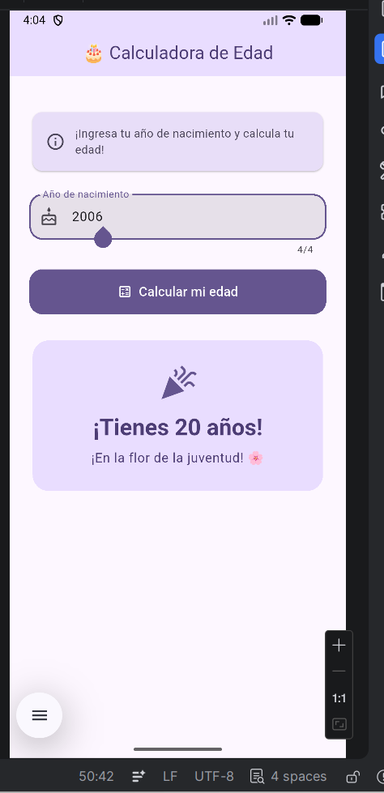
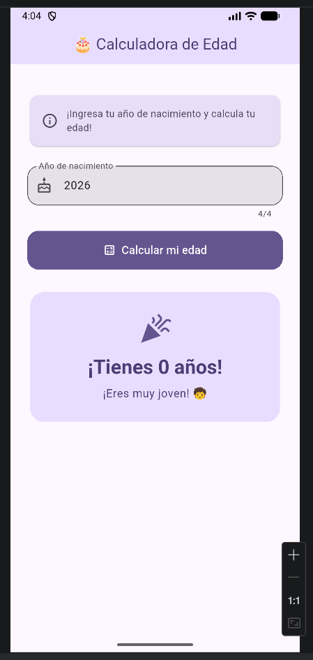
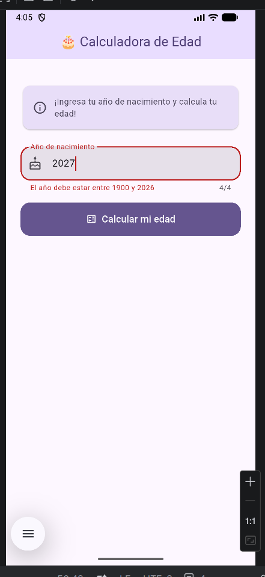
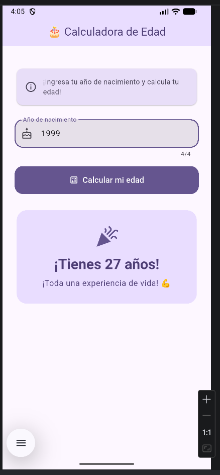

# Calculadora de Edad

Aplicación desarrollada en Flutter para calcular la edad del usuario.

## Capturas de pantalla

### Ejemplo con año 2006

### Ejemplo con año 2026

### Ejemplo de error con año 2027

### Ejemplo con año 1999
